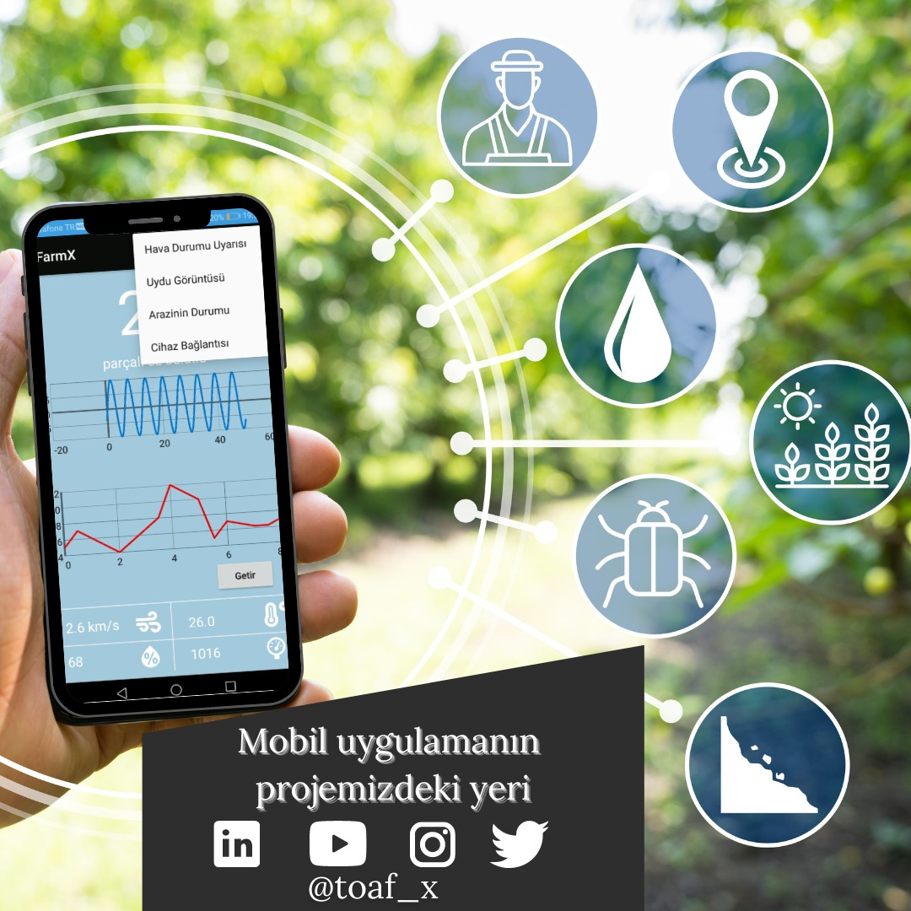
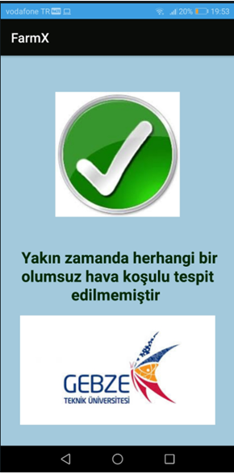
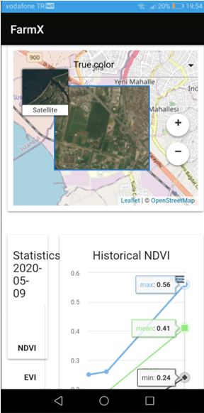
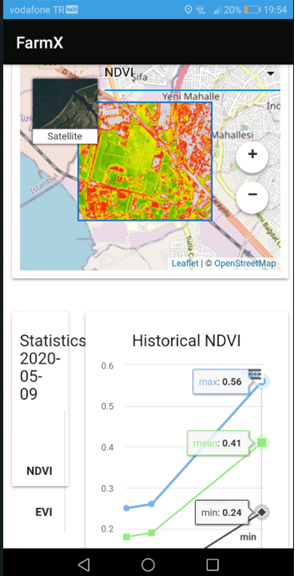
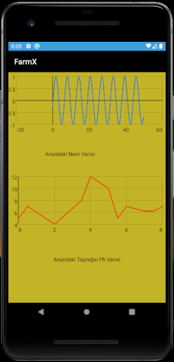
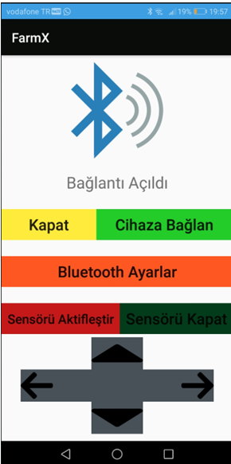

# TOAF Nedir?

[TOAF](https://www.toafx.org/) ekibi farklı üniversitelerden ve farklı disiplinlerden takım arkadaşlarının, ülkedeki tarım verimliliği ve otomasyon ihracatını artırma hedefiyle kurulmuş bir arge takımıdır. TEKNOFEST’te 1468 başvuru arasında finale kalarak geliştirilmesini yaptığımız araçla ilk 10 takım arasına girdik. Uzun süren çalışmalarımız sonucunda elde ettiğimiz takım çalışması deneyimiyle çalışmalarımıza devam ediyoruz.

## TOAFX Mobil Uygulaması



Aracımız üzerinde bulunan sensörler (pH, ec vs.) ve açık kaynak kodlu uydulardan (NDVI, EVI) aldığımız verileri, kendi geliştirdiğimiz mobil uygulamaya kullanıcı dostu ara yüzümüzle çiftçiye aktarıp, yeri geldiğinde çiftçiyi uyarıp en verimli tarımı yapmasını hedefledik. Olağanüstü bir hava durumuyla (don, fırtına vs.) karşılaşılması durumunda çiftçiye alınması gereken önlemlerle ilgili geri bildirimde bulunmayı hedefliyoruz. Aynı zamanda aracımızı manuel olarak kontrol etmemizin gerektiği durumlarda mobil uygulamamız aracılığıyla aracımıza bağlanarak aracımızı kontrol edebiliyoruz. Tarım için önemli olan NDVI, EVI ve toprak sıcaklığı gibi parametreleri; uydu API’ları aracılığıyla mobil uygulamamıza entegre edip çiftçinin arazisi hakkındaki bu değerlere kolayca ulaşmasını sağladık. Ayrıca bu verilerin geçmiş verilerle de karşılaştırılması için belirli tarihler arasında grafikleştirmeler sunabiliyoruz. Sunduğumuz bu verilerin ışığında ileriye dönük yapılacak tarımsal faaliyetlerin daha verimli yapılmasına katkıda bulunmayı amaçlıyoruz.

**Uygulamamızdaki mevcut arayüzler**:

* **Ana Sayfa**
* **Hava Durumu Uyarısı Sayfası**
* **Uydu Görüntüsü Sayfası**
* **Arazinin Durumu Sayfası**
* **Cihaz Bağlantısı Sayfası**

```java
Mobil uygulamamız Android Studio geliştirme ortamında Java dili ile yazılmıştır.
```


### Ana Sayfa

 

Ana sayfa kullanıcımızın konum bilgisi iznini aaldıktan sonra bulnduğu konuma göre hava durumu bilgilerini içeren sayfamızdır.Hava durumu bilgisi içeriği; nem bilgisi, hissedilen sıcaklık bilgisi, basınç bilgisi, rüzgar bilgisi görsellik katmak amacıyla iconları ile birlikte verilmiştir. Ayrıca random değerlerden oluşan geliştirilmek amcıyla eklediğim grafikler mevcuttur.

```java
public class AraziDurumu extends AppCompatActivity {

    LineGraphSeries<DataPoint> series;

    @Override
    protected void onCreate(Bundle savedInstanceState) {
        super.onCreate(savedInstanceState);
        setContentView(R.layout.activity_arazi_durumu);

       double x,y;
        x=-0.5;
        GraphView graph = (GraphView) findViewById(R.id.graph);
        series = new LineGraphSeries<DataPoint>();
       for (int i = 0 ; i < 500 ; i++){
            x = x +0.1;
            y = Math.sin(x) ;
            series.appendData(new DataPoint(x,y), true, 500);
        }

        graph.addSeries(series);
    }
```


### Hava Durumu Uyarısı Sayfası



Olağanüstü bir hava durumuyla (don, fırtına vs.) uyarı verilmesi için geliştirilmek üzere oluşturduğum arayüzümüz.

### Uydu Görüntüsü Sayfası

   

[Agro Api](https://agromonitoring.com/) kullanarak tarım için önemli olan NDVI, EVI ve toprak sıcaklığı gibi parametreleri; mobil uygulamamıza entegre edip çiftçinin arazisi hakkındaki bu değerlere kolayca ulaşmasını sağladık. Ayrıca bu verilerin geçmiş verilerle de karşılaştırılması için belirli tarihler arasında grafikleştirmeler de bulunuyor. Sunduğumuz bu verilerin ışığında ileriye dönük yapılacak tarımsal faaliyetlerin daha verimli yapılmasına katkıda bulunmayı amaçlıyoruz.

### Arazinin Durumu Sayfası



### Cihaz Bağlantısı Sayfası

 


